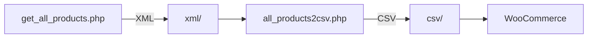

# Litres → WooCommerce: синхронизация каталога

Cкрипты для инкрементальной загрузки каталога [Литрес](https://www.litres.ru/) (partner API) и подготовки CSV для импорта в WooCommerce через плагин `wc-litres-integration`.

## Контекст задачи

Кейс — синхронизация каталога электронных книг партнёра с интернет-магазином на WooCommerce.

**Первичная загрузка.** Полное получение каталога с сервера Литрес занимало порядка **50 минут** — длительный одноразовый прогон, который задавал масштаб задачи по времени и объёму данных.

**Регулярная синхронизация.** По условиям Литрес скрипт получения и обработки инкрементных обновлений нужно было запускать **не реже одного раза в сутки**. В ответ приходили сведения о новых и изменённых позициях — **десятки тысяч записей** за цикл, при том что публиковать на сайте требовалось далеко не всё.

**Почему двухэтапный пайплайн.** Отфильтровать лишнее в самом запросе к API Литрес **нельзя** — партнёр отдаёт полный поток изменений. Поэтому архитектура такая: сначала сохранить XML как есть (`get_all_products.php`), затем на стороне магазина отобрать нужное и собрать «чистые» данные в CSV для импорта (`all_products2csv.php`). Фильтрация в `all_products2csv.php` — по цене, жанрам, издательству, ISBN, флагу продажи и другим правилам магазина.

**Итоговый масштаб.** После отбора в каталог сайта попадали **несколько сотен тысяч** товаров — на порядок меньше, чем сырой поток от Литрес, но всё ещё объём, для которого важны checkpoint, потоковый разбор XML и выгрузка CSV батчами по 3000 строк.

## Пайплайн



1. **get_all_products.php** — запрос к API по checkpoint, сохранение XML в `xml/`.
2. **all_products2csv.php** — потоковый разбор XML (`XMLReader`), фильтрация, батчи по 3000 строк в `csv/`.

## Требования

- PHP 7.4+ (расширения: `curl`, `xml`, `simplexml`)
- WordPress с плагином `wc-litres-integration`
- В настройках плагина (опции WordPress): `litresApiFreshBookUrl`, `litresPlace`, `litres_secretKey`, `litresApiGetFileUrl`, `litresApiGetPdfFileUrl`

Скрипты физически лежат в каталоге плагина `wp-content/plugins/wc-litres-integration/`, но **плагин их не вызывает** — это отдельные CLI-утилиты. Их нужно **запускать вручную из терминала** или по **cron** (например, ежедневный прогон инкремента, как требует Литрес). Плагин лишь хранит настройки API в опциях WordPress и использует подготовленные CSV при импорте товаров.

## Запуск

```bash
# Тип продукта: 0 — текст, 1 — аудио, 4 — PDF (см. документацию Литрес)
php get_all_products.php -t 0
# или по-старому: php get_all_products.php 0

# Имя файла без расширения — как вывел предыдущий скрипт (например litres_products_type0_1)
php all_products2csv.php -f litres_products_type0_1
```

`get_all_products.php` печатает в stdout имя созданного XML (для bash-обёртки). Checkpoint хранится в `checkpoint_<тип>.txt`.

## Что не коммитить

См. `.gitignore`: XML/CSV, checkpoint, `LITRES.log` (в логе подпись `sha` маскируется).

## Особенности реализации

- Инкрементальная синхронизация по checkpoint
- Потоковый XML без загрузки всего файла в память
- Бизнес-фильтры: цена, жанры, издательства, ISBN, флаг `you_can_sell`
- Привязка жанров к категориям WooCommerce (`product_cat` с meta `litres_id`)
- Если у книги нет жанров, подставляется категория по умолчанию — `DEFAULT_PRODUCT_CAT_ID` (15) в `all_products2csv.php`; при другом магазине измените константу под свой `product_cat`
- При первом запуске создаются каталоги `xml/` и `csv/` (см. `.gitignore`)

## Ограничения

- **Не автономный проект** — без WordPress и плагина `wc-litres-integration` скрипты не запускаются (`wp-load.php`, `get_option`, `get_terms`).
- **Секреты не в репозитории** — ключ API, `place` и URL хранятся в опциях WordPress; для работы нужен настроенный магазин.
- **Партнёрский API Литрес** — доступ по договору с Литрес; публикация кода не заменяет партнёрские условия.
- **Бизнес-правила под конкретный магазин** — фильтры жанров, порог цены (`$priceLimit`), списки издательств и `DEFAULT_PRODUCT_CAT_ID` завязаны на ваш каталог; при переносе их нужно пересмотреть.
- **Путь к WordPress** — корень сайта вычисляется из расположения плагина (`str_replace` по `wc-litres-integration`); при другой структуре каталогов путь нужно поправить.
- **Импорт CSV** — формат колонок (в т.ч. `short_decription`) согласован с вашим импортом в WooCommerce; переименование полей может сломать загрузку.

Ошибки CLI выводятся в **stderr**, код выхода **1**; успешный `get_all_products.php` печатает имя XML только в **stdout** (удобно для bash).

## Лицензия

[MIT](LICENSE)
